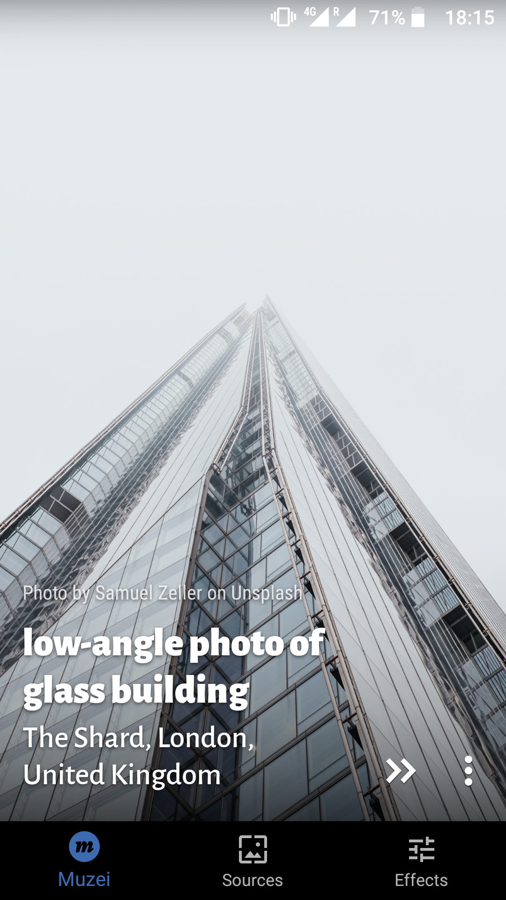
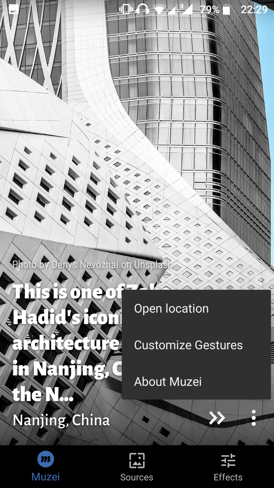
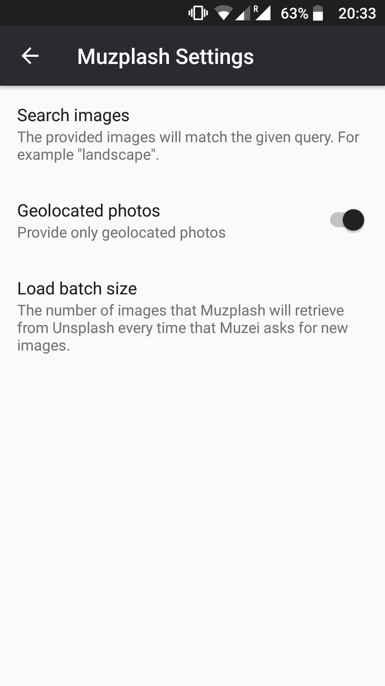

# Muzplash - Unsplash plugin for Muzei

<div>
    
</div>

_Muzplash_ is a plugin for the Android live wallpaper app [Muzei](http://get.muzei.co/), by [Roman Nurik](https://github.com/romannurik) and [Ian Lake](https://github.com/ianhanniballake).<br>
_Muzplash_ provides images from [Unsplash](https://unsplash.com/), the popular photographers community.

## Features
* Implements the new Muzei 3 API.
* Choose the theme of the images to provide. Landscapes, cityscapes, cars or cats, whatever you choose to get.
* Filter out non-geolocated images. Because sometimes it is frustrating to miss the location of that beautiful landscape.
* Get the author, description and location of the image in Muzei, and access the full details in Unsplash in just one click.
* Open the image location in Google Maps within Muzei.
* Choose how many images to load everytime Muzei asks for new pictures. Thus, even if you temporarily don't have internet access, Muzei will probably have a set of unseen images in cache.
* The authors are attributed and their download statistics are incremented.

## Screenshots
<div>
    
    
    
    
</div>

## Build configuration
In order to build _Muzplash_, the Unsplash access key should be defined in the `gradle.properties` of the `app` module (`app/gradle.properties`) under the key `UNSPLASH_ACCESS_KEY`:

```properties
# Access key for the Unsplash API
UNSPLASH_ACCESS_KEY="<your access key>"
```
